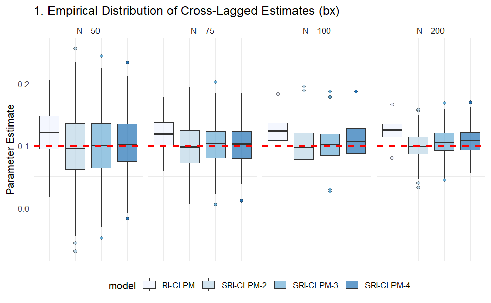
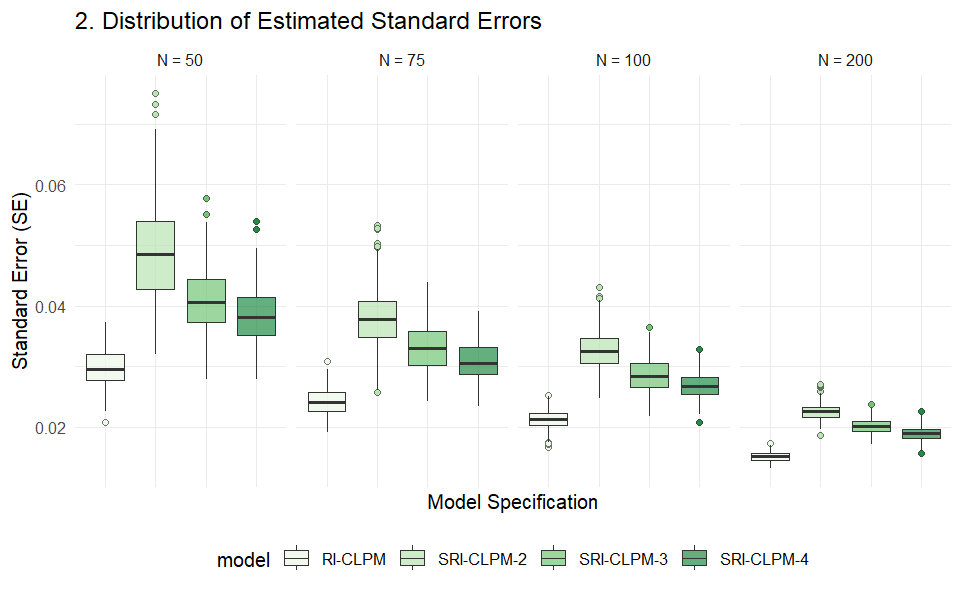
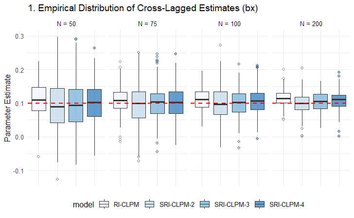
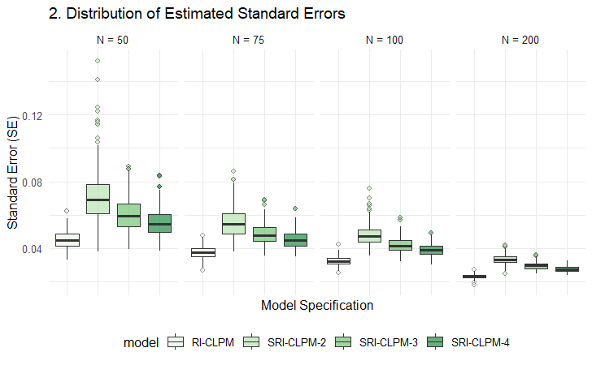
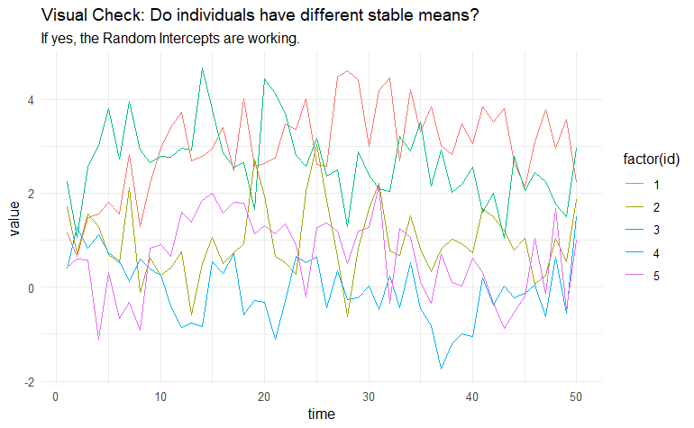
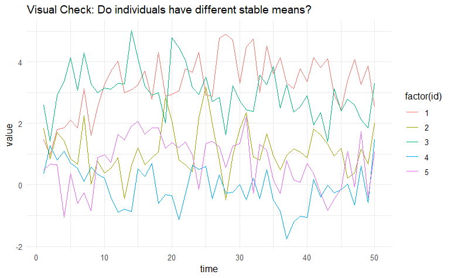

### SRI-CLPM in terms of the bias variance tradeoff

Initial good news is that the SRI-CLPM seems to converge well, even on small samples. I need to test this further, under differing DGM's. Unclear however, is how well the unbiased estimation works under realistic samples.

After some initial small tests, it seems that the unbiased estimation works relatively well, but an important point might be timespan length. In our unrealistic large "population" samples the minimal timespan of 2 worked best. However, at first glance it seems that this might not hold for smaller samples. Here increasing timespan somewhat seems to lead to better estimates, and less inflated SE's.

> A larger analysis of the model behaviour under sparse datasets is needed. It should vary some combinations of two conditions: N (sample size) and T (segment timespan). In addition, the NHST aspect of it should be checked by saving the omnibus p-value.

Questions, known unknowns

-   Is there a "true" standard error I can derive from the DGM? As in, square root of some variance or error I specified somewhere? Should I just compare it to the one estimated in the RICLPM?

-   Can we find some sort of "rule of thumb" for segment timespan, given that estimating smaller timespans on smaller sample sizes seems to increase bias and variance? e.g. at least 20 participants per segment (although this would of course also depend on other variables).

-   Can we do some sort of "empirical power analysis" to test whether the SRI-CLPM is closer to the nominal alpha level compared to the RICLPM?

### Meeting Feb

Convergentie lijkt prima te werken, moet nog wel worden geverifieerd onder andere DGM parameters.





Coverage rate

```{r}
kable(coverage_analysis, 
      digits = 1,
      col.names = 
        c("Sample Size", "Model", "Coverage Rate (%)", "Valid Replications"),
      caption = 
        "Coverage Rates: % of 95% CIs containing the True Value (0.1)")
```

RMSE(A)

Foutmeldingen loggen en analyseren

Long format in Mplus 9 (of alleen fixed effects in Stan)

Andere DGM's

Andere T (kleiner, 12, 18 etc.)

### Meeting 11 Feb

#### Andere T (12)





De vorm / trends zijn precies hetzelfde als met meer timepoints, alleen dan met grotere estimated standaardfouten.

#### Coverage rates

```{r}
results <- sim_T12_warnings_log

coverage_analysis <- results %>%
  filter(converged == TRUE) %>%
  mutate(
    # 1. Calculate 95% Confidence Intervals
    ci_lower = est_bx - (1.96 * se_bx),
    ci_upper = est_bx + (1.96 * se_bx),
    
    # 2. Check if True Value falls inside the Interval
    covered = (true_value >= ci_lower) & (true_value <= ci_upper)
  ) %>%
  
  # 3. Summarize by Condition
  group_by(sample_size, model) %>%
  summarise(
    coverage_rate = mean(covered, na.rm = TRUE) * 100,
    n_valid = n(),
    .groups = "drop"
  )
```

#### SE bias

```{r}
results <- sim_T12_warnings_log

se_bias_analysis <- results %>%
  filter(converged == TRUE) %>%
  group_by(sample_size, model) %>%
  summarise(
    Empirical_SE = sd(est_bx, na.rm = TRUE), # sd of the cross-lagged parameter
    Mean_Estimated_SE = mean(se_bx, na.rm = TRUE), # mean of estimated SE's
    Bias_Percent = ((Mean_Estimated_SE - Empirical_SE) / Empirical_SE) * 100,
    
    .groups = "drop"
  )
view(se_bias_analysis)
```

#### Warnings

```{r}
view(warning_summary)
```

#### Verschil Corr. Matrices

Correlatie matrices kunnen eenvoudig worden gekregen via de lav.Inspect functie. Data is gegenereerd voor 30 timepoints, met N = 40,000. Timespan voor zowel Free als Toeplitz modellen was 3. Een heatmap van de verschil-matrix voor de relaties tussen de random intercepts is als volgt.

```{r}
heatmap
```

Ik kan bijna geen patroon herkennen, en de verschillen zijn erg klein. De Toeplitz-constraints lijken dus voor dit data genererend mechanisme goed te werken.

#### Nieuw DGM

Ik heb een nieuwe variant gemaakt op de DGM functie, die een time-invariant confounder (random intercept) toevoegt. Na wat kleine testjes lijkt hij te werken, ik heb alleen gezien dat het er soms op lijkt dat het proces initieel nog niet helemaal stationair is. Een kleine burn-in periode is dus wellicht handig.





#### Meeting notes

T = 12 met meer replicaties doen (1000)

Varianties constrainen tot hetzelfde (alle RIx hebben dezelfde variantie en alle RIy hebben dezelfde)

Random intercept varianties zijn allemaal exogeen en moeten dus worden geconstrained

Within-person componenten (1ste tijdstip) zijn exogeen, volgende timepoints zijn endogeen en worden voorspeld dus residentiele varianties en covarianties.

### Vragen korte meeting

Covariances van alle RI's worden nu geconstrained naar 0 met de eerste metingen, op dezelfde manier als in de code van Bailey.

IMPORTANT: FIX OOK generate_riclpm functie

```{r}
source("functionSource.R")
library(lavaanPlot)

data <- DGM(timepoints = 6)

md <- sem(generate_segmented_riclpm(T = 6, timespan = 2), data = data$data)

lavaanPlot(md)
summary(md)

cat(generate_segmented_riclpm(T=6, timespan = 2))
```

Idea for a new sim:

performance of CLPM, RI-CLPM and SRI-CLPM on the newly updated DGM with a stable time-invariant component.

Questions this could answer:

Does the SRI-CLPM also offer benefits over a RI-CLPM when the DGM resembles a RI-CLPM + time-varying confounding.

Does the SRI-CLPM 'overcorrect' when a stable component is present. i.e. is the same variance captured multiple times in different random intercepts.

#### Notes

within-segment covariances CovRIx1,2,3 constrained tot hetzelfde

Cross-lagged covarianties tussen RIx en RIy moeten ook toeplitz, maar niet equal X -\> Y, Y -\> X

\^

CHECK OF DIT GELUKT IS

Stable time-invariant confounding, met globaal RI op x en y.

```{r}
# Generate SRI-CLPM with Global RIs model specification
# T: total number of timepoints, timespan: timepoints on which RI's are estimated
# across_seg_cov: has to be "zero", "free" or "toeplitz" 

generate_segmented_riclpm_global <- function(T, timespan = 3, across_seg_cov = "toeplitz") {
  
  # --- 1. Input Validation ---
  if (!is.numeric(T) || T <= 2 || T %% 1 != 0) {
    stop("T must be an integer greater or equal to 3.")
  }
  
  if (!is.numeric(timespan) || timespan <= 0 || timespan %% 1 != 0) {
    stop("timespan must be a positive integer.")
  }
  
  if (timespan > T) {
    stop("timespan cannot be greater than T.")
  }
  
  if (!across_seg_cov %in% c("zero", "free", "toeplitz")) {
    stop("across_seg_cov must be either 'zero', 'free', or 'toeplitz'.")
  }
  
  # --- 2. Determine Number of Segments ---
  n_segments <- ceiling(T / timespan)
  
  # Create a mapping of timepoints to segments
  timepoint_to_segment <- rep(1:n_segments, each = timespan)[1:T]
  
  # --- 3. Generate Global Random Intercepts (spanning ALL timepoints) ---
  global_ri_x <- sprintf("RIgx =~ %s", paste(sprintf("1*x%d", 1:T), collapse = " + "))
  global_ri_y <- sprintf("RIgy =~ %s", paste(sprintf("1*y%d", 1:T), collapse = " + "))
  
  # --- 4. Generate Segmented Random Intercepts ---
  # Structure: All RIx's first, then all RIy's
  
  ri_x_definitions <- c()
  ri_y_definitions <- c()
  
  for (seg in 1:n_segments) {
    # Find which timepoints belong to this segment
    tp_in_seg <- which(timepoint_to_segment == seg)
    
    # Define RIx for this segment
    ri_x_seg <- sprintf("RIx%d =~ %s", seg, 
                        paste(sprintf("1*x%d", tp_in_seg), collapse = " + "))
    
    # Define RIy for this segment
    ri_y_seg <- sprintf("RIy%d =~ %s", seg, 
                        paste(sprintf("1*y%d", tp_in_seg), collapse = " + "))
    
    ri_x_definitions <- c(ri_x_definitions, ri_x_seg)
    ri_y_definitions <- c(ri_y_definitions, ri_y_seg)
  }
  
  # Combine: Global RIs first, then all segmented X's, then all segmented Y's
  ri_definitions <- c(global_ri_x, global_ri_y, ri_x_definitions, ri_y_definitions)
  
  # --- 5. Within-person Component Definitions ---
  wx_defs <- paste(sprintf("wx%d =~ 1*x%d", 1:T, 1:T), collapse = "\n")
  wy_defs <- paste(sprintf("wy%d =~ 1*y%d", 1:T, 1:T), collapse = "\n")
  
  # --- 6. Autoregressive and Cross-lagged Paths ---
  if (T > 1) {
    timepoints_reg <- 2:T
    lagged_timepoints <- 1:(T - 1)
    paths_wx <- paste(sprintf("wx%d ~ ax*wx%d + by*wy%d", 
                              timepoints_reg, lagged_timepoints, lagged_timepoints), 
                      collapse = "\n")
    paths_wy <- paste(sprintf("wy%d ~ bx*wx%d + ay*wy%d", 
                              timepoints_reg, lagged_timepoints, lagged_timepoints), 
                      collapse = "\n")
  } else {
    paths_wx <- ""
    paths_wy <- ""
  }
  
  # --- 7. Covariances ---
  # First wave: covariance (exogenous)
  # Subsequent waves: constrained correlated residuals (endogenous)
  if (T > 1) {
    res_covs <- paste(sprintf("wx%d ~~ ur*wy%d", 2:T, 2:T), collapse = "\n")
  } else {
    res_covs <- ""
  }
  
  # --- 8. Variances of Within-person Components ---
  # First wave: variance (exogenous, no predictors)
  var_wx1 <- "wx1 ~~ wx1"
  var_wy1 <- "wy1 ~~ wy1"
  
  # Subsequent waves: residual variances (endogenous, have predictors)
  if (T > 1) {
    var_wx_rest <- paste(sprintf("wx%d ~~ wx%d", 2:T, 2:T), collapse = "\n")
    var_wy_rest <- paste(sprintf("wy%d ~~ wy%d", 2:T, 2:T), collapse = "\n")
  } else {
    var_wx_rest <- ""
    var_wy_rest <- ""
  }
  
  # --- 9. Fix Observed Variances to Zero ---
  zero_var_x <- paste(sprintf("x%d ~~ 0*x%d", 1:T, 1:T), collapse = "\n")
  zero_var_y <- paste(sprintf("y%d ~~ 0*y%d", 1:T, 1:T), collapse = "\n")
  
  # --- 10. Random Intercept Variances and Covariances ---
  
  ri_variances_and_covs <- c()
  
  # --- 10a. Global RI Variances and Covariance ---
  ri_variances_and_covs <- c(ri_variances_and_covs,
                             "RIgx ~~ varRIgx*RIgx",
                             "RIgy ~~ varRIgy*RIgy",
                             "RIgx ~~ covRIg*RIgy")
  
  # --- 10b. Segmented RI Variances and Within-segment Covariances ---
  
  # First: All RIx variances - CONSTRAINED EQUAL
  for (seg in 1:n_segments) {
    ri_variances_and_covs <- c(ri_variances_and_covs,
                               sprintf("RIx%d ~~ varRIx*RIx%d", seg, seg))
  }
  
  # Second: All RIy variances - CONSTRAINED EQUAL
  for (seg in 1:n_segments) {
    ri_variances_and_covs <- c(ri_variances_and_covs,
                               sprintf("RIy%d ~~ varRIy*RIy%d", seg, seg))
  }
  
  # Third: Within-segment RIx-RIy covariances - CONSTRAINED EQUAL ACROSS SEGMENTS
  for (seg in 1:n_segments) {
    ri_variances_and_covs <- c(ri_variances_and_covs,
                               sprintf("RIx%d ~~ covRI*RIy%d", seg, seg))
  }
  
  # --- 10c. Fix Global-to-Segmented RI Covariances to Zero ---
  global_seg_zero_covs <- c()
  for (seg in 1:n_segments) {
    global_seg_zero_covs <- c(global_seg_zero_covs,
                              sprintf("RIgx ~~ 0*RIx%d", seg),
                              sprintf("RIgx ~~ 0*RIy%d", seg),
                              sprintf("RIgy ~~ 0*RIx%d", seg),
                              sprintf("RIgy ~~ 0*RIy%d", seg))
  }
  
  # --- 10d. Across-segment Covariances for Segmented RIs ---
  ri_across_seg_covs <- c()
  across_seg_label <- ""
  
  if (n_segments > 1) {
    if (across_seg_cov == "zero") {
      # Fixed to zero: independent confounding across segments
      across_seg_label <- "(Fixed to Zero)"
      for (seg1 in 1:(n_segments - 1)) {
        for (seg2 in (seg1 + 1):n_segments) {
          ri_across_seg_covs <- c(ri_across_seg_covs,
                                  sprintf("RIx%d ~~ 0*RIx%d", seg1, seg2),
                                  sprintf("RIy%d ~~ 0*RIy%d", seg1, seg2),
                                  sprintf("RIx%d ~~ 0*RIy%d", seg1, seg2),
                                  sprintf("RIy%d ~~ 0*RIx%d", seg1, seg2))
        }
      }
      
    } else if (across_seg_cov == "free") {
      # Freely estimate all covariances with unique labels
      across_seg_label <- "(Freely Estimated)"
      for (seg1 in 1:(n_segments - 1)) {
        for (seg2 in (seg1 + 1):n_segments) {
          ri_across_seg_covs <- c(ri_across_seg_covs,
                                  sprintf("RIx%d ~~ covRIx_%d_%d*RIx%d", seg1, seg1, seg2, seg2),
                                  sprintf("RIy%d ~~ covRIy_%d_%d*RIy%d", seg1, seg1, seg2, seg2),
                                  sprintf("RIx%d ~~ covRIxy_%d_%d*RIy%d", seg1, seg1, seg2, seg2),
                                  sprintf("RIy%d ~~ covRIyx_%d_%d*RIx%d", seg1, seg1, seg2, seg2))
        }
      }
      
    } else if (across_seg_cov == "toeplitz") {
      # Block Toeplitz structure
      across_seg_label <- "(Block Toeplitz Structure)"
      
      max_lag <- n_segments - 1
      
      # Within-variable Toeplitz (X->X and Y->Y)
      for (lag in 1:max_lag) {
        for (seg1 in 1:(n_segments - lag)) {
          seg2 <- seg1 + lag
          
          ri_across_seg_covs <- c(ri_across_seg_covs,
                                  sprintf("RIx%d ~~ covRIx_lag%d*RIx%d", seg1, lag, seg2))
          ri_across_seg_covs <- c(ri_across_seg_covs,
                                  sprintf("RIy%d ~~ covRIy_lag%d*RIy%d", seg1, lag, seg2))
        }
      }
      
      # Cross-variable Toeplitz (X->Y and Y->X separate)
      for (lag in 1:max_lag) {
        for (seg1 in 1:(n_segments - lag)) {
          seg2 <- seg1 + lag
          
          ri_across_seg_covs <- c(ri_across_seg_covs,
                                  sprintf("RIx%d ~~ covRIxy_lag%d*RIy%d", seg1, lag, seg2))
          ri_across_seg_covs <- c(ri_across_seg_covs,
                                  sprintf("RIy%d ~~ covRIyx_lag%d*RIx%d", seg1, lag, seg2))
        }
      }
    }
  }
  
  # --- 11. Fix RI Covariances with First State to Zero ---
  ri_first_state_zero <- c()
  
  # Global RIs with first state
  ri_first_state_zero <- c(ri_first_state_zero,
                           "wx1 ~~ 0*RIgx",
                           "wx1 ~~ 0*RIgy",
                           "wy1 ~~ 0*RIgx",
                           "wy1 ~~ 0*RIgy")
  
  # Segmented RIs with first state
  for (seg in 1:n_segments) {
    ri_first_state_zero <- c(ri_first_state_zero,
                             sprintf("wx1 ~~ 0*RIx%d", seg),
                             sprintf("wx1 ~~ 0*RIy%d", seg),
                             sprintf("wy1 ~~ 0*RIx%d", seg),
                             sprintf("wy1 ~~ 0*RIy%d", seg))
  }
  
  # --- 12. Assemble Final Model String ---
  
  components <- c(
    "# 1. Random Intercepts",
    "# 1a. Global RIs (spanning all timepoints)",
    global_ri_x,
    global_ri_y,
    "# 1b. Segmented RIs - X then Y",
    paste(ri_x_definitions, collapse = "\n"),
    paste(ri_y_definitions, collapse = "\n"),
    "\n# 2. Within-person components",
    wx_defs,
    wy_defs,
    "\n# 3. Autoregressive and cross-lagged paths",
    paths_wx,
    paths_wy,
    "\n# 4. Covariances",
    "wx1 ~~ wy1 # Covariance at T1",
    res_covs,
    "\n# 5. (Co)variances of Random Intercepts",
    "# 5a. Global RI variances and covariance",
    paste(ri_variances_and_covs[1:3], collapse = "\n"),
    "# 5b. Segmented RI variances (constrained equal) and within-segment covariances (constrained equal)",
    paste(ri_variances_and_covs[4:length(ri_variances_and_covs)], collapse = "\n"),
    "# 5c. Global-to-Segmented RI covariances (fixed to zero)",
    paste(global_seg_zero_covs, collapse = "\n"),
    sprintf("\n# 5d. Across-segment covariances %s", 
            ifelse(n_segments > 1, across_seg_label, "")),
    if (length(ri_across_seg_covs) > 0) paste(ri_across_seg_covs, collapse = "\n") else "# (No across-segment covariances for single segment)",
    "\n# 6. Variances and residual variances of within-person components",
    "# 6a. First wave variances (exogenous)",
    var_wx1,
    var_wy1,
    "# 6b. Subsequent wave residual variances (endogenous)",
    var_wx_rest,
    var_wy_rest,
    "\n# 7. Fix observed variances to zero",
    zero_var_x,
    zero_var_y,
    "\n# 8. Fix RI covariances with first state to zero",
    paste(ri_first_state_zero, collapse = "\n")
  )
  
  components <- components[components != ""]
  model_string <- paste(components, collapse = "\n")
  
  return(model_string)
}
```

```{r}
cat(generate_segmented_riclpm_global(T=6,timespan = 2))
```

#### Kleine initiele sim

```{r}
source("functionSource.R")

# Simulation parameters
n_replications <- 1000
N_participants <- 20000
timepoints <- 12
timespan <- 3
across_seg_cov <- "toeplitz"

# DGM parameters
autocorr_level <- 0.2
beta_focal <- 0.1
ri_var_x <- 1.0  # Time-invariant confounding variance
ri_var_y <- 1.0
ri_cor <- 0.2    # Time-invariant confounding correlation

filename_prefix <- "sri_vs_sri_global_confounding"

cat("=== Exploratory Simulation: SRI-CLPM vs SRI-CLPM-Global ===\n")
cat("Dataset characteristics:\n")
cat("  - N participants:", N_participants, "\n")
cat("  - Timepoints:", timepoints, "\n")
cat("  - Time-varying confounding: autocorr =", autocorr_level, "\n")
cat("  - Time-invariant confounding: var(RIx) =", ri_var_x, 
    ", var(RIy) =", ri_var_y, ", cor =", ri_cor, "\n")
cat("  - True cross-lagged effect:", beta_focal, "\n")
cat("  - Replications:", n_replications, "\n")
cat("  - Segment length:", timespan, "\n\n")

# Create metadata structure
data_struct <- create_metadata()

# True parameter values
true_bx <- beta_focal
true_by <- beta_focal
true_ax <- autocorr_level
true_ay <- autocorr_level

# Initialize storage
replication_results <- data.frame(
  replication = integer(),
  model_type = character(),
  
  # Convergence and diagnostics
  convergence = logical(),
  post_check = logical(),
  n_iterations = integer(),
  
  # Cross-lagged parameters
  bx = numeric(),
  by = numeric(),
  bx_se = numeric(),
  by_se = numeric(),
  bias_bx = numeric(),
  bias_by = numeric(),
  
  # Autoregressive parameters
  ax = numeric(),
  ay = numeric(),
  ax_se = numeric(),
  ay_se = numeric(),
  
  # Random intercept variances
  varRIx = numeric(),
  varRIy = numeric(),
  varRIx_se = numeric(),
  varRIy_se = numeric(),
  
  # Global RI variances (for global model only)
  varRIgx = numeric(),
  varRIgy = numeric(),
  
  # RI covariances
  covRI = numeric(),
  covRIg = numeric(),  # Global RI covariance
  
  # Fit measures
  chisq = numeric(),
  df = numeric(),
  pvalue = numeric(),
  cfi = numeric(),
  tli = numeric(),
  rmsea = numeric(),
  srmr = numeric(),
  aic = numeric(),
  bic = numeric(),
  
  # Processing time
  processing_time = numeric(),
  
  stringsAsFactors = FALSE
)

# Generate model specifications once (they don't change)
modelSpec_sri <- generate_segmented_riclpm(timepoints, timespan = timespan, 
                                           across_seg_cov = across_seg_cov)
modelSpec_sri_global <- generate_segmented_riclpm_global(timepoints, timespan = timespan, 
                                                          across_seg_cov = across_seg_cov)

cat("Starting replications...\n")

# Set up progress tracking
start_time_total <- Sys.time()

# Loop over replications
for (rep in 1:n_replications) {
  
  # Progress report every 50 replications
  if (rep %% 50 == 0) {
    elapsed <- difftime(Sys.time(), start_time_total, units = "mins")
    cat("Replication", rep, "/", n_replications, 
        "- Elapsed time:", round(elapsed, 2), "minutes\n")
  }
  
  # Generate data with both time-varying and time-invariant confounding
  data <- DGM(N = N_participants,
              timepoints = timepoints,
              autocorr_effects = autocorr_level,
              beta_focal = beta_focal,
              ri_var_x = ri_var_x,
              ri_var_y = ri_var_y,
              ri_cor = ri_cor,
              seed = 427 + rep)  # Different seed per replication
  
  # --- FIT SRI-CLPM (Standard) ---
  start_time_sri <- Sys.time()
  
  fit_sri <- tryCatch({
    sem(model = modelSpec_sri, 
        data = data$data,
        estimator = "ML")
  }, error = function(e) {
    NULL
  })
  
  if (!is.null(fit_sri)) {
    converged_sri <- lavInspect(fit_sri, "converged")
    post_check_sri <- tryCatch({
      lavInspect(fit_sri, "post.check")
    }, error = function(e) {
      FALSE
    })
    
    n_iter_sri <- tryCatch({
      fit_sri@optim$iterations
    }, error = function(e) {
      NA
    })
    
    coef_sri <- if(converged_sri) {coef(fit_sri)} else {NULL}
    se_sri <- if(converged_sri) {
      tryCatch({
        sqrt(diag(vcov(fit_sri)))
      }, error = function(e) {
        NULL
      })
    } else {NULL}
    
    fit_measures_sri <- tryCatch({
      fitMeasures(fit_sri, c("chisq", "df", "pvalue", "cfi", "tli", 
                             "rmsea", "srmr", "aic", "bic"))
    }, error = function(e) {
      rep(NA, 9)
    })
    
    # Extract parameters
    bx_sri <- if(converged_sri && "bx" %in% names(coef_sri)) coef_sri["bx"] else NA
    by_sri <- if(converged_sri && "by" %in% names(coef_sri)) coef_sri["by"] else NA
    ax_sri <- if(converged_sri && "ax" %in% names(coef_sri)) coef_sri["ax"] else NA
    ay_sri <- if(converged_sri && "ay" %in% names(coef_sri)) coef_sri["ay"] else NA
    
    bx_se_sri <- if(!is.null(se_sri) && "bx" %in% names(se_sri)) se_sri["bx"] else NA
    by_se_sri <- if(!is.null(se_sri) && "by" %in% names(se_sri)) se_sri["by"] else NA
    ax_se_sri <- if(!is.null(se_sri) && "ax" %in% names(se_sri)) se_sri["ax"] else NA
    ay_se_sri <- if(!is.null(se_sri) && "ay" %in% names(se_sri)) se_sri["ay"] else NA
    
    varRIx_sri <- if(converged_sri && "varRIx" %in% names(coef_sri)) coef_sri["varRIx"] else NA
    varRIy_sri <- if(converged_sri && "varRIy" %in% names(coef_sri)) coef_sri["varRIy"] else NA
    
    varRIx_se_sri <- if(!is.null(se_sri) && "varRIx" %in% names(se_sri)) se_sri["varRIx"] else NA
    varRIy_se_sri <- if(!is.null(se_sri) && "varRIy" %in% names(se_sri)) se_sri["varRIy"] else NA
    
    covRI_sri <- if(converged_sri && "covRI" %in% names(coef_sri)) coef_sri["covRI"] else NA
    
  } else {
    converged_sri <- FALSE
    post_check_sri <- FALSE
    n_iter_sri <- NA
    coef_sri <- NULL
    fit_measures_sri <- rep(NA, 9)
    bx_sri <- by_sri <- ax_sri <- ay_sri <- NA
    bx_se_sri <- by_se_sri <- ax_se_sri <- ay_se_sri <- NA
    varRIx_sri <- varRIy_sri <- varRIx_se_sri <- varRIy_se_sri <- NA
    covRI_sri <- NA
  }
  
  replication_results <- rbind(replication_results, data.frame(
    replication = rep,
    model_type = "SRI-CLPM",
    convergence = converged_sri,
    post_check = post_check_sri,
    n_iterations = n_iter_sri,
    bx = bx_sri,
    by = by_sri,
    bx_se = bx_se_sri,
    by_se = by_se_sri,
    bias_bx = bx_sri - true_bx,
    bias_by = by_sri - true_by,
    ax = ax_sri,
    ay = ay_sri,
    ax_se = ax_se_sri,
    ay_se = ay_se_sri,
    varRIx = varRIx_sri,
    varRIy = varRIy_sri,
    varRIx_se = varRIx_se_sri,
    varRIy_se = varRIy_se_sri,
    varRIgx = NA,
    varRIgy = NA,
    covRI = covRI_sri,
    covRIg = NA,
    chisq = fit_measures_sri[1],
    df = fit_measures_sri[2],
    pvalue = fit_measures_sri[3],
    cfi = fit_measures_sri[4],
    tli = fit_measures_sri[5],
    rmsea = fit_measures_sri[6],
    srmr = fit_measures_sri[7],
    aic = fit_measures_sri[8],
    bic = fit_measures_sri[9],
    processing_time = as.numeric(difftime(Sys.time(), start_time_sri, units = "secs")),
    stringsAsFactors = FALSE
  ))
  
  if (!is.null(fit_sri)) rm(fit_sri)
  
  # --- FIT SRI-CLPM with Global RIs ---
  start_time_sri_global <- Sys.time()
  
  fit_sri_global <- tryCatch({
    sem(model = modelSpec_sri_global, 
        data = data$data,
        estimator = "ML")
  }, error = function(e) {
    NULL
  })
  
  if (!is.null(fit_sri_global)) {
    converged_sri_global <- lavInspect(fit_sri_global, "converged")
    post_check_sri_global <- tryCatch({
      lavInspect(fit_sri_global, "post.check")
    }, error = function(e) {
      FALSE
    })
    
    n_iter_sri_global <- tryCatch({
      fit_sri_global@optim$iterations
    }, error = function(e) {
      NA
    })
    
    coef_sri_global <- if(converged_sri_global) {coef(fit_sri_global)} else {NULL}
    se_sri_global <- if(converged_sri_global) {
      tryCatch({
        sqrt(diag(vcov(fit_sri_global)))
      }, error = function(e) {
        NULL
      })
    } else {NULL}
    
    fit_measures_sri_global <- tryCatch({
      fitMeasures(fit_sri_global, c("chisq", "df", "pvalue", "cfi", "tli", 
                                    "rmsea", "srmr", "aic", "bic"))
    }, error = function(e) {
      rep(NA, 9)
    })
    
    # Extract parameters
    bx_sri_global <- if(converged_sri_global && "bx" %in% names(coef_sri_global)) coef_sri_global["bx"] else NA
    by_sri_global <- if(converged_sri_global && "by" %in% names(coef_sri_global)) coef_sri_global["by"] else NA
    ax_sri_global <- if(converged_sri_global && "ax" %in% names(coef_sri_global)) coef_sri_global["ax"] else NA
    ay_sri_global <- if(converged_sri_global && "ay" %in% names(coef_sri_global)) coef_sri_global["ay"] else NA
    
    bx_se_sri_global <- if(!is.null(se_sri_global) && "bx" %in% names(se_sri_global)) se_sri_global["bx"] else NA
    by_se_sri_global <- if(!is.null(se_sri_global) && "by" %in% names(se_sri_global)) se_sri_global["by"] else NA
    ax_se_sri_global <- if(!is.null(se_sri_global) && "ax" %in% names(se_sri_global)) se_sri_global["ax"] else NA
    ay_se_sri_global <- if(!is.null(se_sri_global) && "ay" %in% names(se_sri_global)) se_sri_global["ay"] else NA
    
    varRIx_sri_global <- if(converged_sri_global && "varRIx" %in% names(coef_sri_global)) coef_sri_global["varRIx"] else NA
    varRIy_sri_global <- if(converged_sri_global && "varRIy" %in% names(coef_sri_global)) coef_sri_global["varRIy"] else NA
    varRIgx_sri_global <- if(converged_sri_global && "varRIgx" %in% names(coef_sri_global)) coef_sri_global["varRIgx"] else NA
    varRIgy_sri_global <- if(converged_sri_global && "varRIgy" %in% names(coef_sri_global)) coef_sri_global["varRIgy"] else NA
    
    varRIx_se_sri_global <- if(!is.null(se_sri_global) && "varRIx" %in% names(se_sri_global)) se_sri_global["varRIx"] else NA
    varRIy_se_sri_global <- if(!is.null(se_sri_global) && "varRIy" %in% names(se_sri_global)) se_sri_global["varRIy"] else NA
    
    covRI_sri_global <- if(converged_sri_global && "covRI" %in% names(coef_sri_global)) coef_sri_global["covRI"] else NA
    covRIg_sri_global <- if(converged_sri_global && "covRIg" %in% names(coef_sri_global)) coef_sri_global["covRIg"] else NA
    
  } else {
    converged_sri_global <- FALSE
    post_check_sri_global <- FALSE
    n_iter_sri_global <- NA
    coef_sri_global <- NULL
    fit_measures_sri_global <- rep(NA, 9)
    bx_sri_global <- by_sri_global <- ax_sri_global <- ay_sri_global <- NA
    bx_se_sri_global <- by_se_sri_global <- ax_se_sri_global <- ay_se_sri_global <- NA
    varRIx_sri_global <- varRIy_sri_global <- varRIgx_sri_global <- varRIgy_sri_global <- NA
    varRIx_se_sri_global <- varRIy_se_sri_global <- NA
    covRI_sri_global <- covRIg_sri_global <- NA
  }
  
  replication_results <- rbind(replication_results, data.frame(
    replication = rep,
    model_type = "SRI-CLPM-Global",
    convergence = converged_sri_global,
    post_check = post_check_sri_global,
    n_iterations = n_iter_sri_global,
    bx = bx_sri_global,
    by = by_sri_global,
    bx_se = bx_se_sri_global,
    by_se = by_se_sri_global,
    bias_bx = bx_sri_global - true_bx,
    bias_by = by_sri_global - true_by,
    ax = ax_sri_global,
    ay = ay_sri_global,
    ax_se = ax_se_sri_global,
    ay_se = ay_se_sri_global,
    varRIx = varRIx_sri_global,
    varRIy = varRIy_sri_global,
    varRIx_se = varRIx_se_sri_global,
    varRIy_se = varRIy_se_sri_global,
    varRIgx = varRIgx_sri_global,
    varRIgy = varRIgy_sri_global,
    covRI = covRI_sri_global,
    covRIg = covRIg_sri_global,
    chisq = fit_measures_sri_global[1],
    df = fit_measures_sri_global[2],
    pvalue = fit_measures_sri_global[3],
    cfi = fit_measures_sri_global[4],
    tli = fit_measures_sri_global[5],
    rmsea = fit_measures_sri_global[6],
    srmr = fit_measures_sri_global[7],
    aic = fit_measures_sri_global[8],
    bic = fit_measures_sri_global[9],
    processing_time = as.numeric(difftime(Sys.time(), start_time_sri_global, units = "secs")),
    stringsAsFactors = FALSE
  ))
  
  if (!is.null(fit_sri_global)) rm(fit_sri_global)
  
  # Clean up
  rm(data)
  if (rep %% 100 == 0) gc(verbose = FALSE)
}

# Add results to data structure
data_struct$results <- replication_results
data_struct$simulation_parameters <- list(
  n_replications = n_replications,
  N_participants = N_participants,
  timepoints = timepoints,
  timespan = timespan,
  across_seg_cov = across_seg_cov,
  autocorr_level = autocorr_level,
  beta_focal = beta_focal,
  ri_var_x = ri_var_x,
  ri_var_y = ri_var_y,
  ri_cor = ri_cor,
  true_bx = true_bx,
  true_by = true_by,
  true_ax = true_ax,
  true_ay = true_ay
)

# Save results
filename <- save_clear(data_struct, filename_prefix)

total_time <- difftime(Sys.time(), start_time_total, units = "mins")

cat("\n=== Simulation Completed ===\n")
cat("Total time:", round(total_time, 2), "minutes\n")
cat("Results saved to:", filename, "\n\n")

# --- SUMMARY STATISTICS ---

cat("=== SUMMARY STATISTICS ===\n\n")

# Convergence rates
cat("--- Convergence Rates ---\n")
convergence_summary <- aggregate(convergence ~ model_type, 
                                 data = replication_results, 
                                 FUN = function(x) {
                                   paste0(sum(x), "/", length(x), 
                                          " (", round(mean(x)*100, 1), "%)")
                                 })
print(convergence_summary)

# Post-check failures (among converged)
cat("\n--- Post-Check Failures (among converged) ---\n")
converged_only <- replication_results[replication_results$convergence == TRUE, ]
postcheck_summary <- aggregate(post_check ~ model_type, 
                               data = converged_only, 
                               FUN = function(x) {
                                 paste0(sum(!x), "/", length(x), 
                                        " (", round((1-mean(x))*100, 1), "%)")
                               })
print(postcheck_summary)

# Bias in cross-lagged parameters
cat("\n--- Mean Bias in Cross-lagged Parameters ---\n")
bias_summary <- aggregate(cbind(bias_bx, bias_by) ~ model_type, 
                         data = converged_only, 
                         FUN = function(x) round(mean(x, na.rm = TRUE), 4))
print(bias_summary)

# RMSE
cat("\n--- RMSE of Cross-lagged Parameters ---\n")
rmse_summary <- aggregate(cbind(bias_bx, bias_by) ~ model_type, 
                         data = converged_only, 
                         FUN = function(x) round(sqrt(mean(x^2, na.rm = TRUE)), 4))
colnames(rmse_summary) <- c("model_type", "rmse_bx", "rmse_by")
print(rmse_summary)

# Mean parameter estimates
cat("\n--- Mean Parameter Estimates ---\n")
param_summary <- aggregate(cbind(bx, by, ax, ay, varRIx, varRIy) ~ model_type, 
                          data = converged_only, 
                          FUN = function(x) round(mean(x, na.rm = TRUE), 4))
print(param_summary)

# Global RI variances (for global model)
cat("\n--- Global RI Variances (SRI-CLPM-Global only) ---\n")
global_only <- converged_only[converged_only$model_type == "SRI-CLPM-Global", ]
if (nrow(global_only) > 0) {
  cat("Mean varRIgx:", round(mean(global_only$varRIgx, na.rm = TRUE), 4), "\n")
  cat("Mean varRIgy:", round(mean(global_only$varRIgy, na.rm = TRUE), 4), "\n")
  cat("Mean covRIg:", round(mean(global_only$covRIg, na.rm = TRUE), 4), "\n")
}

# Model fit comparison
cat("\n--- Mean Fit Indices ---\n")
fit_summary <- aggregate(cbind(cfi, tli, rmsea, srmr, aic, bic) ~ model_type, 
                        data = converged_only, 
                        FUN = function(x) round(mean(x, na.rm = TRUE), 3))
print(fit_summary)

# Processing time
cat("\n--- Mean Processing Time (seconds) ---\n")
time_summary <- aggregate(processing_time ~ model_type, 
                         data = replication_results, 
                         FUN = function(x) round(mean(x, na.rm = TRUE), 2))
print(time_summary)

cat("\nSimulation complete!\n")
```

For our final results, we want to show the performance of our new model under all kinds of DGM. Therefore, I developed a new more flexible DGM function that is able to generate data according to any stationary specification.

```{r}
source("functionSource.R")

DGM <- function(N = 20000, 
                autocorr_effects = 0.2, 
                timepoints = 100, 
                n_x_confounders = 5, 
                n_y_confounders = 5,
                beta_focal = 0.1,
                beta_covfocal = 0.1,
                beta_covnofocal = 0.01,
                sigma = 0.5,
                # -- RANDOM INTERCEPT PARAMETERS (default: no stable component) --
                # Variance of RI for X (0 = no time-invariant confounding)
                ri_var_x = 0, 
                # Variance of RI for Y (0 = no time-invariant confounding)
                ri_var_y = 0,    
                ri_cor = 0, # Correlation between RI_x and RI_y
                seed = 427) 
{
  
  # Set seed for reproducibility
  set.seed(seed)
  
  # Rename some parameters to match the variables used by the original paper
  T <- timepoints
  c1 <- n_x_confounders
  c2 <- n_y_confounders
  alpha <- autocorr_effects
  
  # Helper functions for matrix operations
  irow <- function(x) matrix(x, nrow = sqrt(length(x)), byrow = TRUE)
  row <- function(x) as.vector(t(x))
  
  # --- Determine which type of data to generate ---
  include_time_varying_confounding <- (c1 > 0 || c2 > 0)
  include_time_invariant_confounding <- (ri_var_x > 0 || ri_var_y > 0)
  
  # --- Generate Time-Varying Data (CLPM process) ---
  
  if (include_time_varying_confounding) {
    # Original DGM with time-varying confounders
    
    # Total number of variables (X, Y, and confounders)
    v <- c1 + c2 + 2
    
    # A: Matrix of path coefficients
    A <- matrix(NA, v, v)
    diag(A) <- alpha
    A[lower.tri(A, diag = FALSE)] <- beta_covnofocal 
    A[upper.tri(A, diag = FALSE)] <- beta_covnofocal
    
    c1t <- 3:(2+c1)
    c2t <- (3+c1):v
    A[c1t, 1] <- beta_covfocal
    A[1, c1t] <- beta_covfocal
    A[c2t, 2] <- beta_covfocal
    A[2, c2t] <- beta_covfocal
    A[c1t, c1t][lower.tri(A[c1t, c1t], diag = FALSE)] <- beta_covfocal
    A[c1t, c1t][upper.tri(A[c1t, c1t], diag = FALSE)] <- beta_covfocal
    A[c2t, c2t][lower.tri(A[c2t, c2t], diag = FALSE)] <- beta_covfocal
    A[c2t, c2t][upper.tri(A[c2t, c2t], diag = FALSE)] <- beta_covfocal
    A[1,2] <- beta_focal
    A[2,1] <- beta_focal
    
    # Check the max eigenvalue (to check stationarity)
    max_eigenvalue <- max(eigen(A)$values)
    if (max_eigenvalue >= 1) {
      warning(paste("Maximum eigenvalue is", round(max_eigenvalue, 4),
                    "- the system may not be stationary"))
    }
    
    # Sigma: Var-cov matrix of time-specific residuals
    Sigma <- diag(rep(sigma, v))
    
    # Sigma1: Stationary Var-cov matrix for the first time point
    Sigma1 <- irow(solve(diag(dim(A)[1]^2) - t(A) %x% t(A)) %*% row(Sigma))
    
    # Mean1: Stationary means for first time point
    Mean1 <- matrix(0, nrow = dim(A)[1], ncol = 1)
    
  } else {
    # Simple bivariate VAR(1) without confounders (pure CLPM)
    
    v <- 2
    
    # A: Matrix of path coefficients (just X and Y)
    A <- matrix(c(alpha, beta_focal, beta_focal, alpha), nrow = 2, byrow = TRUE)
    
    # Check the max eigenvalue
    max_eigenvalue <- max(eigen(A)$values)
    if (max_eigenvalue >= 1) {
      warning(paste("Maximum eigenvalue is", round(max_eigenvalue, 4),
                    "- the system may not be stationary"))
    }
    
    # Sigma: Var-cov matrix of time-specific residuals
    Sigma <- diag(rep(sigma, v))
    
    # Sigma1: Stationary Var-cov matrix for the first time point
    Sigma1 <- irow(solve(diag(dim(A)[1]^2) - t(A) %x% t(A)) %*% row(Sigma))
    
    # Mean1: Stationary means for first time point
    Mean1 <- matrix(0, nrow = dim(A)[1], ncol = 1)
  }
  
  # --- Generate time-varying data ---
  
  # Create empty dataframe
  df_within <- matrix(NA, nrow = N, ncol = 2*T)
  
  # Generate the initial values for X and Y and store them in D
  D <- rmvnorm(N, mean = Mean1, Sigma1)
  
  # Store the initial data from D to df_within
  df_within[, 1] <- D[, 1]
  df_within[, 1+T] <- D[, 2]
  
  # Update D and df_within till time T
  for (i in 2:T) {
    D <- D %*% t(A) + rmvnorm(N, sigma = Sigma)
    df_within[, i] <- D[, 1]
    df_within[, i+T] <- D[, 2]
  }
  
  # --- Generate Random Intercepts (Time-Invariant Confounders) ---
  
  if (include_time_invariant_confounding) {
    # Calculate covariance from correlation and variances
    ri_cov <- ri_cor * sqrt(ri_var_x * ri_var_y)
    ri_sigma_mat <- matrix(c(ri_var_x, ri_cov, ri_cov, ri_var_y), nrow = 2)
    
    # Generate N random intercepts
    RIs <- rmvnorm(N, mean = c(0, 0), sigma = ri_sigma_mat)
    colnames(RIs) <- c("RI_x", "RI_y")
    
    # Create final dataframe with RIs added
    df_final <- df_within
    colnames(df_final) <- c(paste("x", 1:T, sep = ""), paste("y", 1:T, sep = ""))
    
    # Add RI_x to all X columns (1 to T)
    df_final[, 1:T] <- df_final[, 1:T] + RIs[, 1]
    
    # Add RI_y to all Y columns (T+1 to 2T)
    df_final[, (T+1):(2*T)] <- df_final[, (T+1):(2*T)] + RIs[, 2]
    
  } else {
    # No random intercepts - just use within-person data
    df_final <- df_within
    colnames(df_final) <- c(paste("x", 1:T, sep = ""), paste("y", 1:T, sep = ""))
    RIs <- NULL
  }
  
  # --- Return results ---
  
  result <- list(
    data = df_final,
    parameters = list(
      N = N,
      timepoints = T,
      n_x_confounders = c1,
      n_y_confounders = c2,
      autocorr_effects = alpha,
      beta_focal = beta_focal,
      beta_covfocal = beta_covfocal,
      beta_covnofocal = beta_covnofocal,
      sigma = sigma,
      StatCOVmatrix = Sigma1,
      max_eigenvalue = max_eigenvalue,
      ri_var_x = ri_var_x,
      ri_var_y = ri_var_y,
      ri_cor = ri_cor,
      data_type = paste0(
        ifelse(include_time_varying_confounding, "time-varying confounding", "no time-varying confounding"),
        " + ",
        ifelse(include_time_invariant_confounding, "time-invariant confounding", "no time-invariant confounding")
      )
    ),
    coefficient_matrix = A
  )
  
  # Add components if RIs were used
  if (include_time_invariant_confounding) {
    result$components <- list(
      within = df_within,
      between = RIs
    )
  }
  
  return(result)
}

PUREdata <- DGM(N = 30000, timepoints = 20, n_x_confounders = 0, n_y_confounders = 0)

summary(sem(generate_clpm(20), data = PUREdata$data))
summary(sem(generate_riclpm(20), data = PUREdata$data))
summary(sem(generate_segmented_riclpm_global(20), data = PUREdata$data))

# CLPM seems to check out

INVdata <- DGM(N = 30000, timepoints = 20, n_x_confounders = 0, n_y_confounders = 0,
               ri_var_x = 1, ri_var_y = 1, ri_cor = .1)

summary(sem(generate_clpm(20), data = INVdata$data))
summary(sem(generate_riclpm(20), data = INVdata$data))
summary(sem(generate_segmented_riclpm_global(20), data = INVdata$data))

# Seems to check out as well

VARdata <- DGM(N = 30000, timepoints = 20, n_x_confounders = 5, n_y_confounders = 5)

summary(sem(generate_clpm(20), data = VARdata$data))
summary(sem(generate_riclpm(20), data = VARdata$data))
summary(sem(generate_segmented_riclpm_global(20), data = VARdata$data))


# Seems okay

BOTHdata <- DGM(N = 30000, timepoints = 20, n_x_confounders = 5, n_y_confounders = 5,
                ri_var_x = 1, ri_var_y = 1, ri_cor = .1)

summary(sem(generate_clpm(20), data = BOTHdata$data))
summary(sem(generate_riclpm(20), data = BOTHdata$data))
summary(sem(generate_segmented_riclpm_global(20), data = BOTHdata$data))

```

### SIM all 4 models

```{r}
### Simulation: Model Performance Across 4 DGM Conditions
### CLPM vs RI-CLPM vs SRI-CLPM vs SRI-CLPM-Global
### Fixed: N = 250, T = 6, timespan = 3, 2000 replications

source("functionSource.R")
library(lavaan)

# ==============================================================================
# SIMULATION PARAMETERS
# ==============================================================================

n_replications  <- 2000
N_participants  <- 250
timepoints      <- 6
timespan        <- 3
across_seg_cov  <- "toeplitz"

# True DGM parameters (shared across all conditions)
autocorr_level  <- 0.2
beta_focal      <- 0.1

true_bx <- beta_focal
true_by <- beta_focal
true_ax <- autocorr_level
true_ay <- autocorr_level

filename_prefix <- "sim_dgm_comparison_T6"

# ==============================================================================
# DGM CONDITIONS
# ==============================================================================
# 1. Pure CLPM      – no confounding of any kind
# 2. RI-CLPM        – time-invariant confounding only (ri_var = 1, ri_cor = .1)
# 3. Time-varying   – time-varying confounding only  (default: 5 confounders each)
# 4. Combined       – both types of confounding

dgm_conditions <- list(
  list(
    name              = "Pure-CLPM",
    n_x_confounders   = 0,
    n_y_confounders   = 0,
    ri_var_x          = 0,
    ri_var_y          = 0,
    ri_cor            = 0
  ),
  list(
    name              = "RI-CLPM",
    n_x_confounders   = 0,
    n_y_confounders   = 0,
    ri_var_x          = 1,
    ri_var_y          = 1,
    ri_cor            = 0.1
  ),
  list(
    name              = "Time-Varying",
    n_x_confounders   = 5,
    n_y_confounders   = 5,
    ri_var_x          = 0,
    ri_var_y          = 0,
    ri_cor            = 0
  ),
  list(
    name              = "Combined",
    n_x_confounders   = 5,
    n_y_confounders   = 5,
    ri_var_x          = 1,
    ri_var_y          = 1,
    ri_cor            = 0.1
  )
)

# ==============================================================================
# MODEL SPECIFICATIONS (generated once – same across DGM conditions)
# ==============================================================================

modelSpec_clpm       <- generate_clpm(timepoints)
modelSpec_riclpm     <- generate_riclpm(timepoints)
modelSpec_sri        <- generate_segmented_riclpm(timepoints,
                                                  timespan        = timespan,
                                                  across_seg_cov  = across_seg_cov)
# Add the global segmented RI-CLPM model
modelSpec_sri_global <- generate_segmented_riclpm_global(timepoints,
                                                         timespan        = timespan,
                                                         across_seg_cov  = across_seg_cov)

cat("=== Simulation: DGM Comparison ===\n")
cat("N =", N_participants, "| T =", timepoints, "| Replications =", n_replications, "\n")
cat("Timespan (SRI-CLPM):", timespan, "| Across-seg cov:", across_seg_cov, "\n\n")

# ==============================================================================
# HELPER: safe extraction from a fitted lavaan object
# ==============================================================================

extract_fit <- function(fit_obj, converged, param_name) {
  if (converged && param_name %in% names(coef(fit_obj)))
    coef(fit_obj)[param_name]
  else
    NA_real_
}

extract_se <- function(se_vec, param_name) {
  if (!is.null(se_vec) && param_name %in% names(se_vec))
    se_vec[param_name]
  else
    NA_real_
}

# ==============================================================================
# HELPER: fit one lavaan model and return a result row
# ==============================================================================

fit_model <- function(model_spec, data_df, model_label, dgm_label,
                      rep_id, true_bx, true_by) {

  start_t <- Sys.time()

  fit <- tryCatch(
    sem(model = model_spec, data = data_df, estimator = "ML"),
    error = function(e) NULL
  )

  if (!is.null(fit)) {

    converged   <- lavInspect(fit, "converged")
    post_check  <- tryCatch(lavInspect(fit, "post.check"), error = function(e) FALSE)
    n_iter      <- tryCatch(fit@optim$iterations,          error = function(e) NA_integer_)

    coef_vec <- if (converged) coef(fit) else NULL
    se_vec   <- if (converged) tryCatch(sqrt(diag(vcov(fit))), error = function(e) NULL) else NULL

    fit_meas <- tryCatch(
      fitMeasures(fit, c("chisq", "df", "pvalue", "cfi", "tli",
                         "rmsea", "srmr", "aic", "bic")),
      error = function(e) setNames(rep(NA_real_, 9),
                                   c("chisq","df","pvalue","cfi","tli",
                                     "rmsea","srmr","aic","bic"))
    )

  } else {
    converged  <- FALSE
    post_check <- FALSE
    n_iter     <- NA_integer_
    coef_vec   <- NULL
    se_vec     <- NULL
    fit_meas   <- setNames(rep(NA_real_, 9),
                           c("chisq","df","pvalue","cfi","tli",
                             "rmsea","srmr","aic","bic"))
  }

  # Extract focal parameters
  bx  <- extract_fit(fit, converged, "bx")
  by  <- extract_fit(fit, converged, "by")
  ax  <- extract_fit(fit, converged, "ax")
  ay  <- extract_fit(fit, converged, "ay")

  bx_se <- extract_se(se_vec, "bx")
  by_se <- extract_se(se_vec, "by")
  ax_se <- extract_se(se_vec, "ax")
  ay_se <- extract_se(se_vec, "ay")

  varRIx    <- extract_fit(fit, converged, "varRIx")
  varRIy    <- extract_fit(fit, converged, "varRIy")
  varRIx_se <- extract_se(se_vec, "varRIx")
  varRIy_se <- extract_se(se_vec, "varRIy")
  covRI     <- extract_fit(fit, converged, "covRI")

  if (!is.null(fit)) rm(fit)

  data.frame(
    replication      = rep_id,
    dgm_condition    = dgm_label,
    model_type       = model_label,

    convergence      = converged,
    post_check       = post_check,
    n_iterations     = n_iter,

    bx               = bx,
    by               = by,
    bx_se            = bx_se,
    by_se            = by_se,
    bias_bx          = bx - true_bx,
    bias_by          = by - true_by,

    ax               = ax,
    ay               = ay,
    ax_se            = ax_se,
    ay_se            = ay_se,

    varRIx           = varRIx,
    varRIy           = varRIy,
    varRIx_se        = varRIx_se,
    varRIy_se        = varRIy_se,
    covRI            = covRI,

    chisq            = fit_meas["chisq"],
    df               = fit_meas["df"],
    pvalue           = fit_meas["pvalue"],
    cfi              = fit_meas["cfi"],
    tli              = fit_meas["tli"],
    rmsea            = fit_meas["rmsea"],
    srmr             = fit_meas["srmr"],
    aic              = fit_meas["aic"],
    bic              = fit_meas["bic"],

    processing_time  = as.numeric(difftime(Sys.time(), start_t, units = "secs")),

    stringsAsFactors = FALSE,
    row.names        = NULL
  )
}

# ==============================================================================
# MAIN SIMULATION LOOP
# ==============================================================================

data_struct <- create_metadata()
start_time_total <- Sys.time()

# Change from 3L to 4L because we're testing 4 models per replication
all_results <- vector("list",
                      length(dgm_conditions) * n_replications * 4L) 
result_idx  <- 1L

for (dgm in dgm_conditions) {

  cat("\n--- DGM condition:", dgm$name, "---\n")

  for (rep in 1:n_replications) {

    if (rep %% 200 == 0) {
      elapsed <- difftime(Sys.time(), start_time_total, units = "mins")
      cat("  DGM:", dgm$name, "| Rep:", rep, "/", n_replications,
          "| Elapsed:", round(elapsed, 2), "min\n")
    }

    # Generate data for this replication
    data <- DGM(
      N                = N_participants,
      timepoints       = timepoints,
      autocorr_effects = autocorr_level,
      beta_focal       = beta_focal,
      n_x_confounders  = dgm$n_x_confounders,
      n_y_confounders  = dgm$n_y_confounders,
      ri_var_x         = dgm$ri_var_x,
      ri_var_y         = dgm$ri_var_y,
      ri_cor           = dgm$ri_cor,
      seed             = 427 + rep  # unique seed per replication
    )

    # Fit CLPM
    all_results[[result_idx]] <- fit_model(
      modelSpec_clpm, data$data, "CLPM", dgm$name,
      rep, true_bx, true_by
    )
    result_idx <- result_idx + 1L

    # Fit RI-CLPM
    all_results[[result_idx]] <- fit_model(
      modelSpec_riclpm, data$data, "RI-CLPM", dgm$name,
      rep, true_bx, true_by
    )
    result_idx <- result_idx + 1L

    # Fit SRI-CLPM
    all_results[[result_idx]] <- fit_model(
      modelSpec_sri, data$data, "SRI-CLPM", dgm$name,
      rep, true_bx, true_by
    )
    result_idx <- result_idx + 1L

    # Fit SRI-CLPM Global (New Model Added)
    all_results[[result_idx]] <- fit_model(
      modelSpec_sri_global, data$data, "SRI-CLPM-Global", dgm$name,
      rep, true_bx, true_by
    )
    result_idx <- result_idx + 1L

    rm(data)
    if (rep %% 100 == 0) gc(verbose = FALSE)
  }
}

replication_results <- do.call(rbind, all_results[1:(result_idx - 1L)])
rownames(replication_results) <- NULL

# ==============================================================================
# SAVE
# ==============================================================================

data_struct$results <- replication_results
data_struct$simulation_parameters <- list(
  n_replications   = n_replications,
  N_participants   = N_participants,
  timepoints       = timepoints,
  timespan         = timespan,
  across_seg_cov   = across_seg_cov,
  autocorr_level   = autocorr_level,
  beta_focal       = beta_focal,
  dgm_conditions   = dgm_conditions,
  true_bx          = true_bx,
  true_by          = true_by,
  true_ax          = true_ax,
  true_ay          = true_ay
)

filename <- save_clear(data_struct, filename_prefix)

total_time <- difftime(Sys.time(), start_time_total, units = "mins")
cat("\n=== Simulation Completed ===\n")
cat("Total time:", round(total_time, 2), "minutes\n")
cat("Results saved to:", filename, "\n\n")

# ==============================================================================
# SUMMARY STATISTICS
# ==============================================================================

cat("=== SUMMARY STATISTICS ===\n\n")

# Convergence rates
cat("--- Convergence Rates ---\n")
conv_summary <- aggregate(
  convergence ~ dgm_condition + model_type,
  data = replication_results,
  FUN  = function(x) paste0(sum(x), "/", length(x),
                            " (", round(mean(x) * 100, 1), "%)")
)
print(conv_summary)

# Post-check failures (among converged)
cat("\n--- Post-Check Failures (among converged) ---\n")
converged_only <- replication_results[replication_results$convergence == TRUE, ]
postcheck_summary <- aggregate(
  post_check ~ dgm_condition + model_type,
  data = converged_only,
  FUN  = function(x) paste0(sum(!x), "/", length(x),
                            " (", round((1 - mean(x)) * 100, 1), "%)")
)
print(postcheck_summary)

# Bias
cat("\n--- Mean Bias in Cross-lagged Parameters ---\n")
bias_summary <- aggregate(
  cbind(bias_bx, bias_by) ~ dgm_condition + model_type,
  data = converged_only,
  FUN  = function(x) round(mean(x, na.rm = TRUE), 4)
)
print(bias_summary)

# RMSE
cat("\n--- RMSE of Cross-lagged Parameters ---\n")
rmse_summary <- aggregate(
  cbind(bias_bx, bias_by) ~ dgm_condition + model_type,
  data = converged_only,
  FUN  = function(x) round(sqrt(mean(x^2, na.rm = TRUE)), 4)
)
colnames(rmse_summary)[3:4] <- c("rmse_bx", "rmse_by")
print(rmse_summary)

# Mean parameter estimates
cat("\n--- Mean Parameter Estimates ---\n")
param_summary <- aggregate(
  cbind(bx, by, ax, ay, varRIx, varRIy) ~ dgm_condition + model_type,
  data = converged_only,
  FUN  = function(x) round(mean(x, na.rm = TRUE), 4)
)
print(param_summary)

# Model fit
cat("\n--- Mean Fit Indices ---\n")
fit_summary <- aggregate(
  cbind(cfi, tli, rmsea, srmr, aic, bic) ~ dgm_condition + model_type,
  data = converged_only,
  FUN  = function(x) round(mean(x, na.rm = TRUE), 3)
)
print(fit_summary)

# Processing time
cat("\n--- Mean Processing Time (seconds) ---\n")
time_summary <- aggregate(
  processing_time ~ dgm_condition + model_type,
  data = replication_results,
  FUN  = function(x) round(mean(x, na.rm = TRUE), 2)
)
print(time_summary)

cat("\nSimulation complete!\n")
```

Timepoints voor simulaties

T = 6, 12, 24, evt 48
